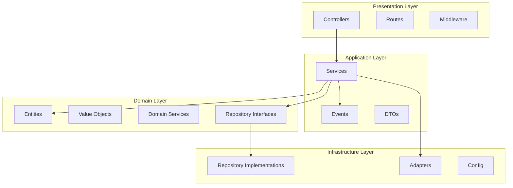

# Enterprise Modules System v2

Un sistema completo de módulos enterprise usando TypeScript avanzado con arquitectura DDD/hexagonal.

## 🏗️ Arquitectura

### Estructura de Capas (Hexagonal/DDD)

```
src/
├── domain/           # Lógica de negocio pura
│   ├── entities/     # Entidades del dominio
│   ├── repositories/ # Interfaces de repositorios
│   ├── services/     # Servicios de dominio
│   └── value-objects/# Value objects
├── application/      # Casos de uso y orquestación
│   ├── services/     # Servicios de aplicación
│   ├── dtos/         # Data Transfer Objects
│   └── events/       # Sistema de eventos
├── infrastructure/   # Implementaciones técnicas
│   ├── repositories/ # Implementaciones de repositorios
│   ├── config/       # Configuración (Namespace)
│   └── adapters/     # Adaptadores externos (Namespace)
├── presentation/     # Capa de presentación
│   ├── controllers/  # Controladores HTTP
│   ├── routes/       # Definición de rutas
│   └── middleware/   # Middleware personalizado (Namespace)
└── shared/           # Código compartido
    ├── types/        # Tipos globales y extensiones
    ├── utils/        # Utilidades
    └── constants/    # Constantes
```

## 🚀 Características Implementadas

### 1. **Declaration Merging**

Sistema de eventos type-safe que usa declaration merging para el registro de tipos:

```typescript
// Los eventos extienden automáticamente la interfaz EventRegistry
declare module "../../shared/types/events" {
  interface EventRegistry {
    "user.created": UserCreatedEvent;
    "order.placed": OrderPlacedEvent;
  }
}
```

### 2. **Namespaces**

Organización clara de funcionalidades relacionadas:

- **Config**: `Config.loadDatabaseConfig()`, `Config.loadEmailConfig()`
- **Adapters**: `Adapters.createEmailAdapter()`, `Adapters.createCacheAdapter()`
- **Middleware**: `Middleware.correlationId`, `Middleware.errorHandler`

### 3. **Path Mapping**

Configuración de TypeScript con aliases para imports limpios:

```typescript
import { UserEntity } from "@domain/entities/User";
import { UserService } from "@application/services/UserService";
```

### 4. **Barrel Exports**

Exports organizados en cada capa para imports limpios:

```typescript
import { UserEntity, IUserRepository } from "@domain";
import { UserService, EventBus } from "@application";
```

### 5. **Sistema de Eventos Type-Safe**

EventBus con tipado fuerte y handlers automáticos:

```typescript
eventBus.publish('user.created', new UserCreatedEvent(...));
eventBus.subscribe('user.created', handler);
```

### 6. **Extensiones de Tipos Globales**

Extensiones para Node.js y Express:

```typescript
// Express Request/Response extensions
interface Request {
  correlationId?: string;
  user?: UserInfo;
}
```

## 🛠️ Instalación y Uso

### Instalación

```bash
npm install
```

### Desarrollo

```bash
npm run dev
```

### Compilación

```bash
npm run build
```

### Verificar tipos

```bash
npm run type-check
```

## 📡 API Endpoints

### Información del Sistema

```http
GET /
```

### Health Check

```http
GET /api/v1/health
```

### Usuarios

```http
POST /api/v1/users
Content-Type: application/json

{
  "name": "Juan Pérez",
  "email": "juan@example.com"
}
```

```http
GET /api/v1/users/:id
```

## 🧪 Pruebas de Funcionalidad

### 1. Crear Usuario (con eventos)

```bash
curl -X POST http://localhost:3000/api/v1/users \
  -H "Content-Type: application/json" \
  -d '{"name": "Juan Pérez", "email": "juan@example.com"}'
```

**Resultado esperado:**

- ✅ Usuario creado en repositorio
- ✅ Evento `user.created` disparado
- ✅ Email de bienvenida enviado
- ✅ Caché invalidado
- ✅ Logs de correlación

### 2. Obtener Usuario

```bash
curl http://localhost:3000/api/v1/users/{user-id}
```

### 3. Validación de Datos

```bash
curl -X POST http://localhost:3000/api/v1/users \
  -H "Content-Type: application/json" \
  -d '{"name": "Test", "email": "invalid-email"}'
```

**Resultado esperado:**

- ❌ Error de validación
- ❌ Request rechazada

## 🎯 Conceptos Avanzados Demostrados

1. **Declaration Merging**: Sistema de eventos con tipos seguros
2. **Namespaces**: Organización de configuración, adapters y middleware
3. **Hexagonal Architecture**: Separación clara de responsabilidades
4. **Type-Safe Event System**: Eventos fuertemente tipados
5. **Path Mapping**: Imports limpios con aliases
6. **Barrel Exports**: Organización de exports por capa
7. **Global Type Extensions**: Extensiones de Node.js y Express
8. **Dependency Injection**: Composición de dependencias en app.ts

## 📦 Tecnologías Utilizadas

- **TypeScript**: Lenguaje principal con características avanzadas
- **Node.js**: Runtime
- **Express**: Framework web
- **UUID**: Generación de IDs únicos
- **ts-node**: Ejecución directa de TypeScript

## 🏆 Arquitectura DDD/Hexagonal



## ✨ Resultado Final

Sistema enterprise completamente funcional que demuestra:

- ✅ Arquitectura hexagonal bien estructurada
- ✅ TypeScript avanzado con declaration merging y namespaces
- ✅ Sistema de eventos type-safe
- ✅ Configuración profesional de TypeScript
- ✅ Organización clara con barrel exports
- ✅ Middleware personalizado con namespaces
- ✅ Manejo de errores y validación
- ✅ Logging y correlación de requests
- ✅ Sin over-engineering - balance perfecto entre funcionalidad y simplicidad
